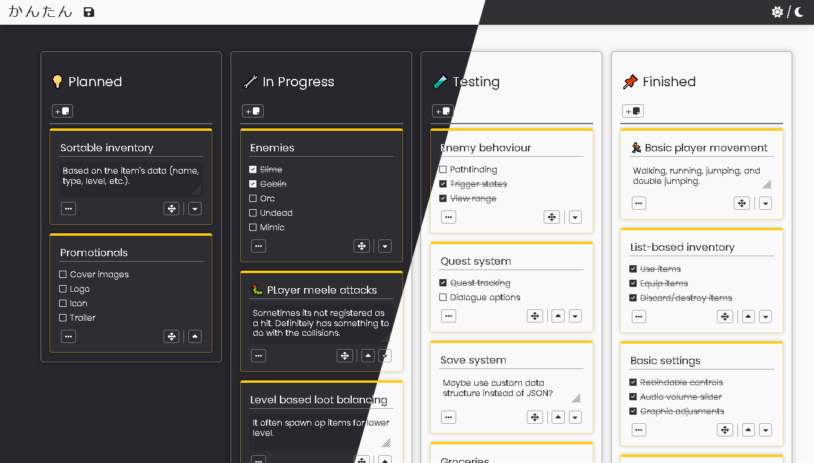

# Kantan \| かんたん 
[](https://www.linkedin.com/in/rakha-djauhari/) [](https://github.com/Zevhys/tool-jam-4/blob/main/LICENSE) 
[](https://github.com/Zevhys/tool-jam-4/actions/workflows/codeql.yml) [](https://github.com/Zevhys/tool-jam-4/actions/workflows/eslint.yml) [](https://github.com/Zevhys/tool-jam-4/actions/workflows/stylelint.yml)

Submission for [The Tool Jam #4](https://itch.io/jam/the-tool-jam-4)

Half-baked kanban board for your productivity. Your boards are saved in the browsers every minute. Or you can save it manually.

<div align="center">
  
</div>

# Tech Stack


# Installation
```bash
# Start a server in development mode on port 8080
npm run start

# Build the app and output it in `/dist`
npm run build
```

# Collaborator
> [!NOTE]  
> <b>I am currently working on a project in collaboration with my friend, [@nndda](https://github.com/nndda)</b>
